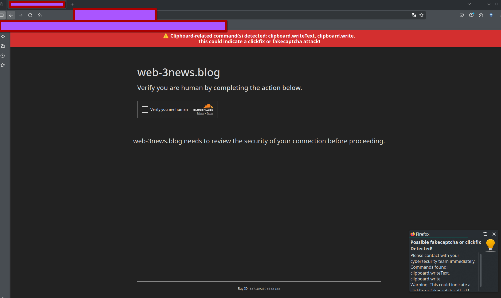
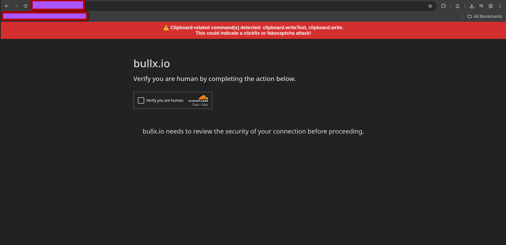

# Sleeping Gorgon

**Sleeping Gorgon** is a browser extension designed to detect and notify users about fake CAPTCHA (fakepcaptcha) and click-fix attacks. It acts as a vigilant guardian, ensuring your browsing experience remains safe from deceptive threats.

## Features

- Real-time detection of fake CAPTCHA and click-fix attacks
- Instant notifications to alert users of suspicious activity
- Lightweight and easy to use

## Installation

### Chrome

1. Download or clone this repository.
2. Open Chrome and go to `chrome://extensions/`.
3. Enable "Developer mode" (top right).
4. Click "Load unpacked" and select the extension folder.

### Firefox

1. Download or clone this repository.
2. Open Firefox and go to `about:debugging#/runtime/this-firefox`.
3. Click "Load Temporary Add-on" and select the `manifest.json` file from the extension folder.

## Project Name

**Sleeping Gorgon** — inspired by mythical guardians, this extension stands watch over your browser.

## Screenshots

Below are example screenshots demonstrating Sleeping Gorgon in action:

### Firefox

|  Example 2 |
|-----------|
|  |

### Chromium

| Example 3 |
|-----------|
|  |

## Compatibility

Sleeping Gorgon is built using Manifest V2 and is compatible with browsers that support this extension format.